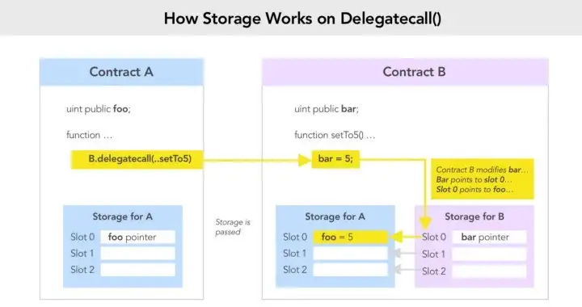

# Level 16 : Preservation

re-read level 6 : *if Contract A invokes Contract B, and you can control Contract B, you can easily mutate the state of Contract A.*

Re-read Level 12 : *If you can match up storage data locations between Contract A and Contract B, you can precisely manipulate the desired variables in Contract A.*



- variable `address public owner` is stored in slot 2 of contract storage
- function `setFirstTime(uint _timeStamp) public` use `delegatecall` to address `timeZone1Library` with function signature `bytes4(keccak256("setTime(uint256)"))` . According to the challenge details, the variable `timeZone1Library` is address of an instance of contract `LibraryContract` that has function `setTime(uint _time) public` that matches the function signature above. ****
- **This function can modify the variable `uint storedTime` stored in slot 0 of `LibraryContract` contract storage => We could use function `setFirstTime(uint _timeStamp) public` to modify `timeZone1Library` in `Preservation`** because a delegatecall keep the memory structure so LibraryContract set the slot 0 of Preservation contract which is `address public timeZone1Library`
1. Deploy malicious contract with setTime function that make owner = msg.sender and that reproduce the data structure of Preservation contract : 
    
    ```solidity
    contract Hack{
        address public timeZone1Library; // SLOT 0
        address public timeZone2Library; // SLOT 1
        address public owner;            // SLOT 2
        uint storedTime;                 // SLOT 3
    
        function setTime(uint _time) public{
            owner=msg.sender;
        }
    }
    ```
    
2. Prepare payload for `function setFirstTime(uint *timeStamp) public` **by converting data** **type `address` to `uint256`** by padding left the address above to 64 character hex*
    
        ⇒ *`let payload = web3.utils.padLeft(address_contract_attacker,64)`*
    
3. Execute function `setFirstTime(uint _timeStamp) public` with our payload as `_timeStamp` argument. This execution would change the `address timeZone1Library` to our malicious contract
4. Now we got `address timeZone1Library` points to our PreservationAttacker instance. Let’s execute `setFirstTime(uint _timeStamp) public` once again. This time, the transaction would execute `setFirstTime(uint _timeStamp) public` in our malicious contract and change the owner address in the challenge instance to `msg.sender`

The main idea is that we want this :

`timeZone1Library.delegatecall(abi.encodePacked(setTimeSignature, _timeStamp));`

to do this : 

`attacker_contract.delegatecall(abi.encodedPacked(SetTimeOfAttackerContract,_timestamp));`